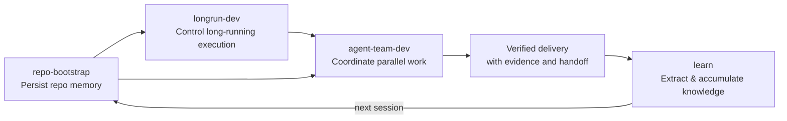

<div align="right">

[](./README.md)
[](./README_CN.md)

</div>

<div align="center">

<table>
  <tr>
    <td width="96" valign="middle">
      
    </td>
    <td valign="middle" align="left">
      <h1>Harness Craft</h1>
      <strong>Turn agentic coding from a one-off prompt trick into a durable engineering system.</strong><br/>
      <sub>Built for Claude Code and Codex. Skills for depth. Always-on guardrails for instinct. Evidence for delivery.</sub>
    </td>
  </tr>
</table>

[](./skills)
[](./rules)
[](#the-4-flagship-skills)
[](#core-idea)
[](#contributing)

<br/>

<a href="#quick-start"><strong>Quick Start</strong></a>
·
<a href="#the-4-flagship-skills"><strong>Flagship Skills</strong></a>
·
<a href="#rules-reference"><strong>Rules / AGENTS</strong></a>
·
<a href="#full-skill-inventory"><strong>Full Inventory</strong></a>

</div>

---

This repository is built around a simple belief:

> The biggest failure mode in agent-driven development is not intelligence — it is **system instability**.

Most teams don't get blocked because the model "can't write code". They get blocked because:

<table>
  <tr>
    <td width="50%" valign="top">
      The agent understood the repo yesterday and acts like it has amnesia today.
    </td>
    <td width="50%" valign="top">
      Multiple agents look busy, but their changes collide and review quality is weak.
    </td>
  </tr>
  <tr>
    <td width="50%" valign="top">
      Plans, validation status, and handoff context live only inside chat transcripts.
    </td>
    <td width="50%" valign="top">
      The agent feels done, while the repository is still not in a deliverable state.
    </td>
  </tr>
</table>

These are not prompt problems. They are **engineering system problems**.

## Quick Navigation

<table>
  <tr>
    <td width="33%" valign="top">
      <strong><a href="#core-idea">Core Idea</a></strong><br/>
      Why this repo treats agent work as a system problem, not a prompt problem.
    </td>
    <td width="33%" valign="top">
      <strong><a href="#quick-start">Quick Start</a></strong><br/>
      Install Claude or Codex in one command.
    </td>
    <td width="33%" valign="top">
      <strong><a href="#the-4-flagship-skills">Flagship Skills</a></strong><br/>
      The four skills that form the operating system.
    </td>
  </tr>
  <tr>
    <td width="33%" valign="top">
      <strong><a href="#how-the-stack-fits-together">System Fit</a></strong><br/>
      See how memory, execution, collaboration, and learning reinforce each other.
    </td>
    <td width="33%" valign="top">
      <strong><a href="#skills-vs-rules">Skills vs Rules</a></strong><br/>
      Separate long workflows from always-on guardrails.
    </td>
    <td width="33%" valign="top">
      <strong><a href="#rules-reference">Rules / AGENTS</a></strong><br/>
      Understand how Claude `rules/` maps to Codex `AGENTS.md`.
    </td>
  </tr>
  <tr>
    <td width="33%" valign="top">
      <strong><a href="#full-skill-inventory">Full Inventory</a></strong><br/>
      Browse the complete reusable skill library.
    </td>
    <td width="33%" valign="top">
      <strong><a href="#who-this-is-for">Who This Is For</a></strong><br/>
      Check whether this stack fits your workflow.
    </td>
    <td width="33%" valign="top">
      <strong><a href="#contributing">Contributing</a></strong><br/>
      Add new skills or rules without breaking the design discipline.
    </td>
  </tr>
</table>

## Core Idea

The goal is not to add one more clever prompt. The goal is to upgrade agent work into a system that is:

<table>
  <tr>
    <td width="33%" valign="top">
      <strong>Persistent</strong><br/>
      Repo knowledge survives context-window loss.
    </td>
    <td width="33%" valign="top">
      <strong>Verifiable</strong><br/>
      Progress is tied to evidence, not model confidence.
    </td>
    <td width="33%" valign="top">
      <strong>Collaborative</strong><br/>
      Multiple agents work with clear boundaries.
    </td>
  </tr>
  <tr>
    <td width="50%" valign="top">
      <strong>Recoverable</strong><br/>
      Long tasks resume from stable state, not vague memory.
    </td>
    <td width="50%" valign="top" colspan="2">
      <strong>Learnable</strong><br/>
      Agents accumulate knowledge from interactions and get smarter over time.
    </td>
  </tr>
</table>

### Prompt Tricks vs. Engineering Systems

| Prompt-First Workflow | System-First Workflow |
| --- | --- |
| Context lives in chat history | Context is written to repo-local artifacts |
| Completion is based on model confidence | Completion is based on evidence and checks |
| Multi-agent work is ad hoc | Roles, ownership, and review gates are explicit |
| Long tasks drift across sessions | Long tasks resume from structured state |
| Handoffs are fragile | Handoffs are built into the workflow |

## Quick Start

### One-Command Install (Recommended)

#### Platform At A Glance

| Dimension | Claude Code | Codex |
| --- | --- | --- |
| Skills home | `~/.claude/skills/` | `~/.codex/skills/` |
| Always-on layer | `~/.claude/rules/` or `.claude/rules/` | `~/.codex/AGENTS.md` or `.codex/AGENTS.md` |
| Recommended install | `python3 scripts/install.py --assistant claude --profile flagship --with-python-rules` | `python3 scripts/install.py --assistant codex --profile flagship --with-python-rules` |
| After install | Start a new Claude session | Restart Codex, then start a new session |

> [!TIP]
> New here? Install the flagship profile first. It gives you the smallest
> complete system: persistent context, long-run execution, controlled
> collaboration, and learned knowledge.

<details>
<summary><strong>Claude Code</strong></summary>

```bash
python3 scripts/install.py --assistant claude --profile flagship --with-python-rules

# Full collection
python3 scripts/install.py --assistant claude --profile all --with-python-rules

# Project-scoped rules for the current repo
python3 scripts/install.py --assistant claude --skip-skills --scope project --project-root "$(pwd)"
```

What the installer does:

- installs skills into `~/.claude/skills/`
- installs always-on guardrails into `~/.claude/rules/` or `.claude/rules/`

</details>

<details>
<summary><strong>Codex (OpenAI)</strong></summary>

```bash
python3 scripts/install.py --assistant codex --profile flagship --with-python-rules

# Full collection
python3 scripts/install.py --assistant codex --profile all --with-python-rules

# Project-scoped guardrails for the current repo
python3 scripts/install.py --assistant codex --skip-skills --scope project --project-root "$(pwd)"
```

What the installer does:

- installs skills into `~/.codex/skills/`
- installs always-on guardrails into `~/.codex/AGENTS.md` or `.codex/AGENTS.md`
- uses a managed block, so existing user-written AGENTS content outside that block is preserved
- restart Codex after installation so new sessions pick up the updated `AGENTS.md`

</details>

### Why Codex Uses `AGENTS.md`

Claude has a native `rules/` layer. Codex does not. In Codex, the always-on
equivalent is `AGENTS.md`, so the installer renders the same guardrails into a
managed `AGENTS.md` block.

That means:

- **Claude**: rules stay as short markdown files under `~/.claude/rules/` or `.claude/rules/`
- **Codex**: the same rule layer is installed into `~/.codex/AGENTS.md` or `.codex/AGENTS.md`

In both cases, the end result is the same: always-on guardrails with no manual
invocation once installed.

### Manual Install (Fallback)

If you prefer not to use the installer, skills can still be copied manually.

```bash
# Claude skills
mkdir -p ~/.claude/skills
cp -R skills/repo-bootstrap ~/.claude/skills/
cp -R skills/longrun-dev ~/.claude/skills/
cp -R skills/learn ~/.claude/skills/
cp -R skills/agent-team-dev ~/.claude/skills/

# Codex skills
mkdir -p ~/.codex/skills
cp -R skills/repo-bootstrap ~/.codex/skills/
cp -R skills/longrun-dev ~/.codex/skills/
cp -R skills/learn ~/.codex/skills/
cp -R skills/agent-team-dev ~/.codex/skills/
```

Claude rules can also be installed manually:

```bash
mkdir -p ~/.claude/rules
cp -r rules/common ~/.claude/rules/
cp -r rules/python ~/.claude/rules/   # pick your language

# Or project-level (current project only)
mkdir -p .claude/rules
cp -r rules/common .claude/rules/
```

For Codex guardrails, prefer `scripts/install.py` because Codex needs
`AGENTS.md` management rather than direct `rules/` copying.

Once installed, the AI agent will automatically:

<table>
  <tr>
    <td width="50%" valign="top">
      Use `feat:` / `fix:` / `refactor:` commit format.
    </td>
    <td width="50%" valign="top">
      Check for hardcoded secrets, SQL injection, and XSS before every commit.
    </td>
  </tr>
  <tr>
    <td width="50%" valign="top">
      Enforce immutable patterns, functions under 50 lines, and coverage above 80%.
    </td>
    <td width="50%" valign="top">
      Add Python type annotations and prefer frozen dataclasses.
    </td>
  </tr>
  <tr>
    <td width="50%" valign="top">
      Trigger code review proactively after writing code.
    </td>
    <td width="50%" valign="top">
      Load and apply learned knowledge from previous sessions.
    </td>
  </tr>
</table>

## The 4 Flagship Skills

If you only try four things from this repo, start here:

<table>
  <tr>
    <td width="50%" valign="top">
      <br/>
      <strong><code>repo-bootstrap</code></strong><br/>
      <em>Context layer</em><br/>
      Persist repo understanding into durable local artifacts.
    </td>
    <td width="50%" valign="top">
      <br/>
      <strong><code>longrun-dev</code></strong><br/>
      <em>Execution layer</em><br/>
      Keep long tasks narrow, stateful, and evidence-backed across sessions.
    </td>
  </tr>
  <tr>
    <td width="50%" valign="top">
      <br/>
      <strong><code>learn</code></strong><br/>
      <em>Knowledge layer</em><br/>
      Turn repeated corrections and patterns into reusable memory.
    </td>
    <td width="50%" valign="top">
      <br/>
      <strong><code>agent-team-dev</code></strong><br/>
      <em>Collaboration layer</em><br/>
      Coordinate bounded multi-agent work without chaos.
    </td>
  </tr>
</table>

| Skill | Layer | Core Problem | Design Lever | Typical Outputs |
| --- | --- | --- | --- | --- |
| `repo-bootstrap` | Context | Repo knowledge gets lost between sessions | Split understanding into durable documents | `.harness/state.json`, `memory.md`, `prompt.md`, `repowiki.md`, `plan.md`, `checklist.md` |
| `longrun-dev` | Execution | Long tasks drift, lose focus, or declare done too early | Stateful harness with evidence-backed completion | `.longrun/init.sh`, `feature_list.json`, `progress.md`, `session_state.json` |
| `agent-team-dev` | Collaboration | Multi-agent work collides without governance | Compact engineering team with explicit ownership | task contract, role packets, `A1/I1/T1/R1` artifacts |
| `learn` | Knowledge | Valuable knowledge from interactions gets lost between sessions | Structured extraction with strength-based evolution | `~/.claude/learned/` or `~/.codex/learned/`, knowledge files with `weak→medium→strong` progression |

---

### `repo-bootstrap`

**Protects context.** The real power of this skill is not generating a few documents — it turns repo understanding from hidden background knowledge into an explicit, persistent workspace.

#### What problem it actually solves

An agent needs more than source code to work effectively. It also needs to know:

- What the user is actually trying to achieve
- What decisions have already been made
- How the repo is actually built, tested, and deployed
- What is still unknown or uncertain
- Whether the current plan still matches execution reality

When this information lives only in chat history, it is extremely fragile. One session switch, one parallel thread, one agent handoff — and facts mix with assumptions.

#### Architecture

This skill splits repo cognition into six durable artifacts:

- `.harness/state.json`: machine-readable single source of truth
- `.harness/memory.md`: ongoing working memory
- `.harness/prompt.md`: user intent, constraints, explanation history
- `.harness/repowiki.md`: repo facts — directories, commands, environment
- `.harness/plan.md`: design approach, assumptions, risks, validation paths
- `.harness/checklist.md`: real execution ledger — file changes, validation status

These responsibilities must stay separated:

| File | What it owns | Why it can't be merged |
| --- | --- | --- |
| `memory.md` | Ongoing working memory | Mixed with repo facts, it becomes an unstructured diary |
| `prompt.md` | User intent and constraints | Task semantics shouldn't couple with repo structure |
| `repowiki.md` | Repo operations, directories, commands | Long-term facts shouldn't be polluted by session noise |
| `plan.md` | Design approach, risks, validation paths | Future actions are not the same as past execution |
| `checklist.md` | Execution ledger, verification status | Real progress shouldn't be rewritten into design prose |

#### Why this design is strong

1. It doesn't pretend automation can replace understanding. Scripts can auto-detect languages, frameworks, commands, config files and directory structure — but that automation only builds the skeleton. It doesn't claim to provide deep understanding.

2. It treats update rules as governance, not suggestions. `memory.md` and `prompt.md` should be updated every session; repo fact changes must be reflected in `repowiki.md`; non-trivial implementations must sync `plan.md` and `checklist.md`.

3. It manages unknowns explicitly. A mature memory system records not only what is known, but also what is still unknown, how to discover it, and what should not be assumed by default.

This makes the system more honest, and much easier to hand off.

---

### `longrun-dev`

**Keeps long tasks on track.** Most agent demos excel at showing how work *starts*. The real difficulty is controlling how work *continues*.

#### Why long tasks fail most often

Once a task spans many sessions, highly predictable failure modes emerge:

- The agent doesn't know where it left off last time
- The baseline is already broken, but it keeps building on top of the damage
- Feature scope drifts silently across rounds
- Progress is narrative only — no structure
- The model *feels* done, but the system has zero completion evidence

These problems can't be solved by adding another paragraph that says "please work carefully." They require state files, recovery entry points, execution order, completion criteria, and scope throttling.

#### Architecture

This skill generates a longrun harness inside the target repo:

- `.longrun/init.sh`: dependency setup and smoke checks
- `.longrun/feature_list.json`: feature definitions with pass/fail status
- `.longrun/progress.md`: append-only session progress log
- `.longrun/session_state.json`: current recovery state and session info

The most important point: **long-task state becomes a repo asset, not a conversation asset.**

#### Control model

| Constraint | Design intent | What it prevents |
| --- | --- | --- |
| One feature per session | Limit scope expansion | Doing too much, drifting, "while I'm here" creep |
| Run `init.sh` first | Restore health before new work | Building on a broken baseline |
| `feature_list.json` status-only updates | Freeze feature definitions | Quietly rewriting the target mid-flight |
| `progress.md` append-only | Preserve traceable history | Overwriting history, making handoff impossible |
| Evidence required for completion | Turn "feels done" into "verified done" | Premature completion based on model confidence |

#### Why it embodies real "systems thinking"

The most powerful idea in this skill is not complexity — it is restraint.

"One feature per session" looks simple, but it is one of the highest-leverage control points for agents. The most common advanced failure mode is not that agents *can't* do the work — it's that they do too much, too broadly, beyond the original task boundary.

This skill cuts long-horizon tasks into a series of verifiable, recoverable, accountable units. At the end of each session, the system can re-evaluate:

- Is the baseline healthy?
- Is the scope stable?
- Is the evidence sufficient?

This is the kind of engineering constraint that long-running autonomous development actually needs.

---

### `agent-team-dev`

**Governs multi-agent collaboration.** The hardest problem in multi-agent systems is not parallel capacity — it is boundary governance.

#### What problem it actually solves

Multi-agent workflows spiral out of control because:

- Multiple agents edit the same files with no clear ownership
- Everyone is analyzing, but nobody owns final integration authority
- Review happens too early, or is too broad
- The main thread loses its role as the single source of truth

Without governance, multi-agent just amplifies single-agent instability.

#### Architecture

This skill deliberately keeps the team in a small, explicit topology:

| Role | Write scope | Responsibility | Why this separation |
| --- | --- | --- | --- |
| Team Lead | Integration & arbitration | Task contract, staffing, conflict resolution, final verification | Must retain the single source of truth |
| Solution Architect | Read-only | Design brief, risk hotspots, file impact map | Design must precede changes |
| Feature Engineer | Production code | Smallest safe implementation patch | Isolate implementation from other concerns |
| Test Engineer | Test code | Test coverage, regression protection | Make verification an independent responsibility |
| Reviewer / Verifier | Read-only | Review the integrated result | Avoid unfocused feedback on half-finished work |

#### Mode selection

| Mode | When to use | Staffing | Design goal |
| --- | --- | --- | --- |
| Mode A | Small change, low risk, single module | 0–1 sub-agents | Lowest coordination overhead |
| Mode B | Implementation and testing can parallelize | 2 sub-agents | Higher throughput without losing control |
| Mode C | High risk, cross-module, independent review needed | 3–4 sub-agents | Correctness-first full protection |

#### How it differs from "role-play" multi-agent

It doesn't indulge in the theatrics of multi-agent — it returns to the fundamentals of engineering organization:

- The main thread must retain a Team Lead
- Parallelism is not the default — it is a risk-driven choice
- Roles exist for responsibility isolation, not for appearances
- Review must be independent, and must happen after integration
- There can only be one source of truth

The point of this skill is not "more agents = smarter" — it's "multiple agents must be governed first."

---

### `learn`

**Makes agents smarter over time.** Every conversation between a developer and an agent contains high-value knowledge: corrections, patterns, facts, preferences. Without a learning system, this knowledge evaporates when the session ends. The agent starts from zero next time, and the user has to teach the same things again.

#### What problem it actually solves

- The agent was corrected last session — "don't mock the database" — and this session it mocks it again
- The user has said "keep responses concise" three times, but the agent is still verbose
- The project has a specific deploy pipeline, and it needs to be re-explained every time
- User coding preferences (naming style, architecture patterns) are never remembered

#### Architecture

This skill is built around one core belief: **conversations are a gold mine of reusable knowledge that gets wasted every time a session ends.** What the user teaches the agent should be systematically preserved.

| Design choice | Why | What it prevents |
| --- | --- | --- |
| Two commands only (`/learn` + `/learn-review`) | Minimal cognitive load | Too many commands that users won't bother to learn |
| Markdown files, not YAML/JSON | Human-readable, directly editable, git-friendly | Black-box knowledge that users can't inspect or correct |
| Three-tier strength (`weak→medium→strong`) | Simple but effective validation model | Floating-point pseudo-precision (0.47 vs 0.52 is meaningless) |
| Project + Global scoping | Keep project knowledge isolated | React habits leaking into a Python project |
| Semi-automatic promotion | User confirms before globalizing | Wrong knowledge polluting all projects — false promotion costs more than missed promotion |
| Quality gate (Save/Merge/Skip) | Filter noise before saving | Knowledge directory becoming a junk drawer |

#### Four knowledge types, prioritized

1. **Corrections** — user corrected the agent's approach (highest value). These represent mistakes the agent made and must never repeat.
2. **Patterns** — repeated workflow or coding convention. E.g., "in this project, always run lint before commit."
3. **Facts** — project/environment-specific truths. E.g., "CI uses Node 20", "deploy requires staging approval."
4. **Preferences** — user's personal style choices. E.g., "keep responses concise", "write comments in Chinese."

#### Strength evolution model

One of the most carefully designed aspects of `learn`. Knowledge is not permanently valid once saved — it needs to be validated, strengthened, and can be overturned:

```
New knowledge created → strength: weak, confirmed: 0
  ↓ Applied once without user correction
strength: weak, confirmed: 1
  ↓ Applied again without correction
strength: medium, confirmed: 2
  ↓ Repeatedly validated
strength: strong, confirmed: 4+
  ↓ User explicitly confirms ("yes, exactly")
strength: strong (immediate jump)
```

User says "no, that's wrong" → downgrade or delete. No automatic decay — knowledge doesn't disappear just because it hasn't been used recently. Stale knowledge is cleaned up through `/learn-review`.

This is more practical than floating-point confidence: `weak/medium/strong` is enough to distinguish "first observation" from "thoroughly validated" without forcing the system to split hairs between 0.47 and 0.52.

#### Scope isolation and promotion

Knowledge is stored at two levels:

- **Project** (`.claude/learned/` or `.codex/learned/`): project-specific knowledge, the default destination
- **Global** (`~/.claude/learned/` or `~/.codex/learned/`): cross-project universal knowledge

Promotion rules are deliberately conservative: only when a project-scoped entry reaches `strength = strong` and its content contains no project-specific references will the system **suggest** promotion — but the user always confirms.

Why not auto-promote? Because the cost of false promotion (polluting global scope) far exceeds the cost of missed promotion (teaching it again in another project).

#### User experience design

"Getting smarter over time" can't just be a technical fact — the user must **feel** it:

- Every `/learn` run clearly reports what was learned, what was skipped, and why
- When the agent makes a different decision based on learned knowledge, it says so:
  > "Using real database for integration tests (learned: don't mock DB)"
- `/learn-review` shows cumulative statistics: 23 global entries / 12 project entries
- New sessions announce: "Loaded 8 project entries and 15 global entries"

**Why it works:** Conversations are full of knowledge that agents lose between sessions. This skill turns that loss into lasting growth. Two commands, Markdown files, three strength tiers, and a quality gate — simple enough to actually use, transparent enough to trust, and structured enough to compound over time.

#### How learned knowledge actually takes effect

The `learn` skill only **stores** knowledge — it does not auto-load. To close
the loop, install the assistant's always-on guardrail layer:

- **Claude Code**: install the `learned-knowledge` rule from `rules/common/`
- **Codex**: install harness-craft's managed `AGENTS.md` block via `scripts/install.py`

Once installed, the agent will automatically load and apply accumulated
knowledge in future sessions. The full pipeline:

```
/learn → saves knowledge files → always-on guardrails auto-load them next session → agent applies and cites
```

Without that always-on layer, `/learn` still extracts knowledge, but future
sessions won't use it automatically. See [Quick Start](#quick-start) and the
[Rules Reference](#rules-reference) for installation details.

## How the Stack Fits Together



- `repo-bootstrap` makes the agent **remember** the project
- `longrun-dev` makes the agent **stay on track**
- `agent-team-dev` makes multiple agents **cooperate without chaos**
- `learn` makes the agent **get smarter** over time

## Skills vs Rules

This repo provides two complementary systems:

| | Skills | Rules |
|--|--------|-------|
| **Analogy** | Playbook | Constitution |
| **Loading** | On-demand via `/skill-name` | Always-on guardrails every session |
| **Context cost** | Full text loaded only when invoked | Always loaded (each is short) |
| **Best for** | Long workflows (TDD, E2E, deep research…) | Short global constraints (style, security, git…) |
| **Activation** | User-triggered | Claude: `rules/`; Codex: `AGENTS.md` |

**In short:** Rules are the agent's **instincts**. Skills are the agent's
**learned expertise**. Claude and Codex expose the always-on layer
differently, but the design goal is the same.

## Rules Reference

> Rules take effect automatically after installation. In Claude they live in
> `rules/`; in Codex the same guardrails are rendered into `AGENTS.md`.

### Common Rules (all languages)

| Rule | What It Enforces |
|------|-----------------|
| `coding-style` | Immutable data patterns; functions <50 lines, files <800 lines, nesting <4 levels |
| `security` | Pre-commit checks: no hardcoded secrets, parameterized SQL, XSS/CSRF protection |
| `testing` | TDD (write tests first); coverage ≥80% |
| `git-workflow` | Commit format `<type>: <description>`; PR analyzes full commit history |
| `code-review` | Auto-review after writing code; CRITICAL issues block merge |
| `development-workflow` | Full dev flow: search existing solutions → plan → TDD → review → commit |
| `patterns` | Search for battle-tested skeletons first; Repository Pattern recommended |
| `performance` | Model selection guidance (Haiku / Sonnet / Opus); context window management |
| `agents` | Auto-dispatch sub-agents: complex features → planner, code written → reviewer |
| `learned-knowledge` | Load learned knowledge (Claude: `~/.claude/learned/` + `.claude/learned/`; Codex: `~/.codex/learned/` + `.codex/learned/`) at session start; apply corrections, patterns, facts, preferences; cite sources |
| `hooks` | TodoWrite best practices, permission control guide |

### Python Rules (`.py`/`.pyi` files only)

| Rule | What It Enforces |
|------|-----------------|
| `coding-style` | PEP 8; type annotations required; `frozen=True` dataclass for immutability |
| `patterns` | Protocol duck typing, dataclass DTO, context manager, generator idioms |
| `security` | `os.environ["KEY"]` strict access; bandit static scanning |
| `testing` | pytest + `--cov`; `pytest.mark.unit/integration` categorization |
| `hooks` | Python project hook integration guide |

## Full Skill Inventory

Beyond the flagship quartet, the repo includes a broader reusable library:

<details>
<summary><strong>View all 46 skills</strong></summary>

### Engineering & Quality

| Skill | Purpose |
| --- | --- |
| `⭐⭐ repo-bootstrap` | Persist repo memory with structured context documents |
| `⭐⭐ longrun-dev` | Long-horizon development with stateful harness |
| `⭐⭐ learn` | Extract and accumulate knowledge from interactions |
| `agent-team-dev` | Multi-agent team with explicit ownership and review gates |
| `⭐ api-design` | Production REST API design patterns |
| `⭐ backend-patterns` | Node/Express/Next.js backend architecture |
| `⭐ frontend-patterns` | React/Next.js frontend architecture |
| `⭐ coding-standards` | Unified coding standards for JS/TS/React/Node |
| `⭐ security-review` | Security checklist for sensitive changes |
| `⭐ tdd-workflow` | Test-driven development workflow |
| `e2e-testing` | Playwright E2E testing patterns |
| `⭐ verification-loop` | End-to-end verification before delivery |
| `eval-harness` | Eval-driven development framework |
| `dmux-workflows` | Multi-agent orchestration via dmux/tmux |
| `strategic-compact` | Context compaction at milestone boundaries |

### Frontend, Design & Automation

| Skill | Purpose |
| --- | --- |
| `⭐ canvas-design` | Visual art and poster generation (.png/.pdf) |
| `figma` | Pull design context from Figma MCP |
| `figma-implement-design` | 1:1 Figma-to-code implementation |
| `⭐ frontend-design` | Production-grade frontend UI design |
| `⭐ playwright` | Real-browser automation from terminal |
| `develop-web-game` | Iterative web-game dev + testing loop |
| `frontend-slides` | HTML slide decks and PPT-to-web conversion |
| `screenshot` | OS-level screenshot capture |
| `webapp-testing` | Playwright-based local web app testing |

### Research, Docs & Knowledge

| Skill | Purpose |
| --- | --- |
| `⭐ deep-research` | Multi-source cited deep research |
| `market-research` | Market/competitor/investor diligence |
| `paper-deep-review` | Structured paper dissection |
| `⭐ openai-docs` | Official OpenAI docs lookup with citations |
| `exa-search` | Exa neural web/code/company search |
| `⭐ article-writing` | Long-form writing with voice consistency |
| `doc` | `.docx` authoring/editing with layout checks |
| `pdf` | PDF extraction/generation/review |

### GitHub, Ops & Delivery

| Skill | Purpose |
| --- | --- |
| `⭐ gh-address-comments` | Resolve PR review comments systematically |
| `⭐ gh-fix-ci` | Diagnose and fix failing GitHub Actions |
| `yeet` | Stage/commit/push/open PR in one flow |
| `linear` | Linear issue and project management |

### Content, Media & Growth

| Skill | Purpose |
| --- | --- |
| `content-engine` | Multi-platform content system design |
| `crosspost` | Channel-specific cross-post adaptation |
| `video-editing` | AI-assisted video editing pipeline |
| `fal-ai-media` | Image/video/audio generation via fal.ai |
| `x-api` | X/Twitter API integration |

### Business & Fundraising

| Skill | Purpose |
| --- | --- |
| `investor-materials` | Fundraising decks, memos, and models |
| `investor-outreach` | Investor outreach copywriting |

### Platform Integrations

| Skill | Purpose |
| --- | --- |
| `claude-api` | Claude API integration patterns |
| `⭐ mcp-builder` | Build MCP servers (Python FastMCP / Node SDK) |
| `skill-creator` | Create or refine skills |
| `skill-installer` | Install skills into local environment |

</details>

## Recommended Operating Order

For serious repo work, a strong default is:

1. Install skills and rules (see [Quick Start](#quick-start))
2. Use `repo-bootstrap` to make repo knowledge persistent
3. Use `longrun-dev` when the task will span multiple sessions
4. Use `learn` after productive sessions to accumulate knowledge
5. Use `agent-team-dev` only when bounded parallelism is worth the coordination cost
6. Layer on domain-specific skills after the operating system is in place

Companion skills by category:

- **Architecture:** `api-design`, `backend-patterns`, `frontend-patterns`, `coding-standards`
- **Quality:** `tdd-workflow`, `e2e-testing`, `verification-loop`, `security-review`
- **Research:** `deep-research`, `openai-docs`, `article-writing`
- **Delivery:** `gh-address-comments`, `gh-fix-ci`, `yeet`, `linear`

## Who This Is For

- Builders who want agents to act more like **durable collaborators** than chat assistants
- Teams running multi-step implementation, testing, and delivery through agents
- Engineers who care about **handoff quality**, verification discipline, and controlled autonomy
- Anyone who has felt that agent workflows are impressive in demos but unreliable in production

## Contributing

Contributions are welcome. The standard is practical usefulness.

A good contribution should:

- Solve a recurring real-world problem
- Have clear trigger conditions
- Define a concrete workflow, not generic advice
- Include scripts or references when they materially improve execution
- Rules should stay short (10–50 lines each) — move long workflows to skills

---

<div align="center">

**[Skills](./skills)** · **[Rules](./rules)** · **[Issues](https://github.com/YuxiaoWang-520/harness-craft/issues)** · **[Contributing](#contributing)**

</div>
