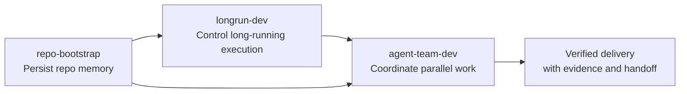

<div align="right">

[](./README.md)
[](./README_CN.md)

</div>

<div align="center">

# Harness Craft

**Turn agentic coding from a one-off prompt trick into a durable engineering system.**

[](./skills)
[](./rules)
[](#the-3-flagship-skills)
[](#core-idea)
[](#contributing)

</div>

---

This repository is built around a simple belief:

> The biggest failure mode in agent-driven development is not intelligence — it is **system instability**.

Most teams don't get blocked because the model "can't write code". They get blocked because:

- the agent understood the repo yesterday and acts like it has amnesia today
- multiple agents look busy, but their changes collide and review quality is weak
- plans, validation status, and handoff context live only inside chat transcripts
- the agent feels done, while the repository is still not in a deliverable state

These are not prompt problems. They are **engineering system problems**.

## Contents

- [Core Idea](#core-idea)
- [Quick Start](#quick-start)
- [The 3 Flagship Skills](#the-3-flagship-skills)
- [How the Stack Fits Together](#how-the-stack-fits-together)
- [Skills vs Rules](#skills-vs-rules)
- [Rules Reference](#rules-reference)
- [Full Skill Inventory](#full-skill-inventory)
- [Who This Is For](#who-this-is-for)
- [Contributing](#contributing)

## Core Idea

The goal is not to add one more clever prompt. The goal is to upgrade agent work into a system that is:

- **Persistent** — repo knowledge survives context-window loss
- **Verifiable** — progress is tied to evidence, not model confidence
- **Collaborative** — multiple agents work with clear boundaries
- **Recoverable** — long tasks resume from stable state, not vague memory

### Prompt Tricks vs. Engineering Systems

| Prompt-First Workflow | System-First Workflow |
| --- | --- |
| Context lives in chat history | Context is written to repo-local artifacts |
| Completion is based on model confidence | Completion is based on evidence and checks |
| Multi-agent work is ad hoc | Roles, ownership, and review gates are explicit |
| Long tasks drift across sessions | Long tasks resume from structured state |
| Handoffs are fragile | Handoffs are built into the workflow |

## Quick Start

### Install Skills

<details>
<summary><strong>Claude Code</strong></summary>

```bash
# Install the 3 flagship skills
mkdir -p ~/.claude/skills
cp -R skills/repo-bootstrap ~/.claude/skills/
cp -R skills/longrun-dev ~/.claude/skills/
cp -R skills/agent-team-dev ~/.claude/skills/

# Or install the full collection
cp -R skills/* ~/.claude/skills/
```

Expected structure:

```text
~/.claude/skills/
  repo-bootstrap/
  longrun-dev/
  agent-team-dev/
  ...
```

</details>

<details>
<summary><strong>Codex (OpenAI)</strong></summary>

```bash
# Install the 3 flagship skills
mkdir -p ~/.codex/skills
cp -R skills/repo-bootstrap ~/.codex/skills/
cp -R skills/longrun-dev ~/.codex/skills/
cp -R skills/agent-team-dev ~/.codex/skills/

# Or install the full collection
cp -R skills/* ~/.codex/skills/
```

Expected structure:

```text
~/.codex/skills/
  repo-bootstrap/
  longrun-dev/
  agent-team-dev/
  ...
```

</details>

### Install Rules (Always-On Guardrails)

Rules are auto-injected into every session — no manual invocation needed.

```bash
# User-level (applies to all projects)
mkdir -p ~/.claude/rules
cp -r rules/common ~/.claude/rules/
cp -r rules/python ~/.claude/rules/   # pick your language

# Or project-level (current project only)
mkdir -p .claude/rules
cp -r rules/common .claude/rules/
```

Once installed, the AI agent will automatically:
- use `feat:`/`fix:`/`refactor:` commit format
- check for hardcoded secrets, SQL injection, XSS before every commit
- enforce immutable patterns, functions <50 lines, coverage ≥80%
- add type annotations and frozen dataclass for Python files
- trigger code review proactively after writing code

## The 3 Flagship Skills

If you only try three things from this repo, start here:

| Skill | Layer | Core Problem | Design Lever | Typical Outputs |
| --- | --- | --- | --- | --- |
| `repo-bootstrap` | Context | Repo knowledge gets lost between sessions | Split understanding into durable documents | `codex/state.json`, `memory.md`, `prompt.md`, `repowiki.md`, `plan.md`, `checklist.md` |
| `longrun-dev` | Execution | Long tasks drift, lose focus, or declare done too early | Stateful harness with evidence-backed completion | `.longrun/init.sh`, `feature_list.json`, `progress.md`, `session_state.json` |
| `agent-team-dev` | Collaboration | Multi-agent work collides without governance | Compact engineering team with explicit ownership | task contract, role packets, `A1/I1/T1/R1` artifacts |

---

### `repo-bootstrap`

**Protects context.** Turns repo understanding from hidden background knowledge into an explicit, persistent workspace.

A capable agent needs more than source code — it needs to know what the user is trying to achieve, what decisions were already made, what gaps remain, and whether the plan still matches execution reality.

This skill separates repo cognition into six durable artifacts:

| File | Responsibility | Why It Must Stay Separate |
| --- | --- | --- |
| `state.json` | Machine-readable source of truth | Canonical state for automation |
| `memory.md` | Ongoing working memory | Mixed with repo facts, it becomes an unstructured diary |
| `prompt.md` | User intent and constraints | Task semantics shouldn't be buried in repo structure |
| `repowiki.md` | Stable repo knowledge | Long-term facts shouldn't be polluted by session noise |
| `plan.md` | Intended path forward | Plans are not the same as execution reality |
| `checklist.md` | Real execution ledger | Actual progress shouldn't be rewritten into design prose |

**Why it works:** It doesn't pretend automation replaces understanding. It treats update rules as governance, not suggestions. And it manages unknowns explicitly — a good memory system stores what is still missing, not just what is known.

---

### `longrun-dev`

**Keeps long tasks on track.** Most demos show how an agent starts. Real engineering needs to control how an agent *continues*.

Once a task spans many sessions, failure modes are predictable: the agent loses its place, baseline is already broken, scope drifts silently, and "done" is declared without evidence.

| Constraint | Why It Exists | What It Prevents |
| --- | --- | --- |
| One feature per session | Limits scope expansion | "While I'm here" drift and hidden scope creep |
| Run `init.sh` first | Restore health before new work | Building on a broken baseline |
| `feature_list.json` status-only | Freeze feature definitions | Quietly rewriting the target mid-flight |
| `progress.md` append-only | Preserve traceability | History loss and weak handoff |
| Evidence required for completion | Tie done-ness to validation | Premature "done" based on model confidence |

**Why it works:** The strongest idea is restraint. "One feature per session" is one of the highest-leverage control points — agents don't only fail by being incapable, they fail by doing too much, too broadly, too early.

---

### `agent-team-dev`

**Governs multi-agent collaboration.** The point of multi-agent systems is not "more minds" — it's better decomposition with stronger boundaries.

| Role | Write Scope | Responsibility |
| --- | --- | --- |
| Team Lead | Integration | Task contract, staffing, conflict resolution, final verification |
| Solution Architect | Read-only | Design brief, risk hotspots, file impact map |
| Feature Engineer | Production code | Smallest safe implementation patch |
| Test Engineer | Tests & fixtures | Coverage, regression protection, test evidence |
| Reviewer / Verifier | Read-only | Independent review of integrated result |

Three orchestration modes based on risk:

| Mode | When | Agents | Goal |
| --- | --- | --- | --- |
| Mode A | Small, low-risk, single-module | 0–1 | Lowest coordination overhead |
| Mode B | Implementation + testing can parallelize | 2 | Throughput without losing control |
| Mode C | High-risk, cross-module, independent review needed | 3–4 | Correctness-first protection |

**Why it works:** It doesn't simulate an entire company. It optimizes for explicit file ownership, clear role packets, independent review after integration, and a single arbitration point.

## How the Stack Fits Together



- `repo-bootstrap` makes the agent **remember**
- `longrun-dev` makes the agent **stay on track**
- `agent-team-dev` makes multiple agents **cooperate without chaos**

## Skills vs Rules

This repo provides two complementary systems:

| | Skills | Rules |
|--|--------|-------|
| **Analogy** | Playbook | Constitution |
| **Loading** | On-demand via `/skill-name` | Auto-injected every session |
| **Context cost** | Full text loaded only when invoked | Always loaded (each is short) |
| **Best for** | Long workflows (TDD, E2E, deep research…) | Short global constraints (style, security, git…) |
| **Activation** | User-triggered | Auto-enforced every turn |

**In short:** Rules are the agent's **instincts**. Skills are the agent's **learned expertise**.

## Rules Reference

> Rules take effect automatically after installation. No manual invocation needed.

### Common Rules (all languages)

| Rule | What It Enforces |
|------|-----------------|
| `coding-style` | Immutable data patterns; functions <50 lines, files <800 lines, nesting <4 levels |
| `security` | Pre-commit checks: no hardcoded secrets, parameterized SQL, XSS/CSRF protection |
| `testing` | TDD (write tests first); coverage ≥80% |
| `git-workflow` | Commit format `<type>: <description>`; PR analyzes full commit history |
| `code-review` | Auto-review after writing code; CRITICAL issues block merge |
| `development-workflow` | Full dev flow: search existing solutions → plan → TDD → review → commit |
| `patterns` | Search for battle-tested skeletons first; Repository Pattern recommended |
| `performance` | Model selection guidance (Haiku / Sonnet / Opus); context window management |
| `agents` | Auto-dispatch sub-agents: complex features → planner, code written → reviewer |
| `hooks` | TodoWrite best practices, permission control guide |

### Python Rules (`.py`/`.pyi` files only)

| Rule | What It Enforces |
|------|-----------------|
| `coding-style` | PEP 8; type annotations required; `frozen=True` dataclass for immutability |
| `patterns` | Protocol duck typing, dataclass DTO, context manager, generator idioms |
| `security` | `os.environ["KEY"]` strict access; bandit static scanning |
| `testing` | pytest + `--cov`; `pytest.mark.unit/integration` categorization |
| `hooks` | Python project hook integration guide |

## Full Skill Inventory

Beyond the flagship trio, the repo includes a broader reusable library:

<details>
<summary><strong>View all 41 skills</strong></summary>

### Engineering & Quality

| Skill | Purpose |
| --- | --- |
| `⭐⭐ repo-bootstrap` | Persist repo memory with structured context documents |
| `⭐⭐ longrun-dev` | Long-horizon development with stateful harness |
| `agent-team-dev` | Multi-agent team with explicit ownership and review gates |
| `⭐ api-design` | Production REST API design patterns |
| `⭐ backend-patterns` | Node/Express/Next.js backend architecture |
| `⭐ frontend-patterns` | React/Next.js frontend architecture |
| `⭐ coding-standards` | Unified coding standards for JS/TS/React/Node |
| `⭐ security-review` | Security checklist for sensitive changes |
| `⭐ tdd-workflow` | Test-driven development workflow |
| `e2e-testing` | Playwright E2E testing patterns |
| `⭐ verification-loop` | End-to-end verification before delivery |
| `eval-harness` | Eval-driven development framework |
| `dmux-workflows` | Multi-agent orchestration via dmux/tmux |
| `strategic-compact` | Context compaction at milestone boundaries |

### Frontend, Design & Automation

| Skill | Purpose |
| --- | --- |
| `figma` | Pull design context from Figma MCP |
| `figma-implement-design` | 1:1 Figma-to-code implementation |
| `⭐ playwright` | Real-browser automation from terminal |
| `develop-web-game` | Iterative web-game dev + testing loop |
| `frontend-slides` | HTML slide decks and PPT-to-web conversion |
| `screenshot` | OS-level screenshot capture |

### Research, Docs & Knowledge

| Skill | Purpose |
| --- | --- |
| `⭐ deep-research` | Multi-source cited deep research |
| `market-research` | Market/competitor/investor diligence |
| `paper-deep-review` | Structured paper dissection |
| `⭐ openai-docs` | Official OpenAI docs lookup with citations |
| `exa-search` | Exa neural web/code/company search |
| `⭐ article-writing` | Long-form writing with voice consistency |
| `doc` | `.docx` authoring/editing with layout checks |
| `pdf` | PDF extraction/generation/review |

### GitHub, Ops & Delivery

| Skill | Purpose |
| --- | --- |
| `⭐ gh-address-comments` | Resolve PR review comments systematically |
| `⭐ gh-fix-ci` | Diagnose and fix failing GitHub Actions |
| `yeet` | Stage/commit/push/open PR in one flow |
| `linear` | Linear issue and project management |

### Content, Media & Growth

| Skill | Purpose |
| --- | --- |
| `content-engine` | Multi-platform content system design |
| `crosspost` | Channel-specific cross-post adaptation |
| `video-editing` | AI-assisted video editing pipeline |
| `fal-ai-media` | Image/video/audio generation via fal.ai |
| `x-api` | X/Twitter API integration |

### Business & Fundraising

| Skill | Purpose |
| --- | --- |
| `investor-materials` | Fundraising decks, memos, and models |
| `investor-outreach` | Investor outreach copywriting |

### Platform Integrations

| Skill | Purpose |
| --- | --- |
| `claude-api` | Claude API integration patterns |
| `skill-creator` | Create or refine skills |
| `skill-installer` | Install skills into local environment |

</details>

## Recommended Operating Order

For serious repo work, a strong default is:

1. Install skills and rules (see [Quick Start](#quick-start))
2. Use `repo-bootstrap` to make repo knowledge persistent
3. Use `longrun-dev` when the task will span multiple sessions
4. Use `agent-team-dev` only when bounded parallelism is worth the coordination cost
5. Layer on domain-specific skills after the operating system is in place

Companion skills by category:

- **Architecture:** `api-design`, `backend-patterns`, `frontend-patterns`, `coding-standards`
- **Quality:** `tdd-workflow`, `e2e-testing`, `verification-loop`, `security-review`
- **Research:** `deep-research`, `openai-docs`, `article-writing`
- **Delivery:** `gh-address-comments`, `gh-fix-ci`, `yeet`, `linear`

## Who This Is For

- Builders who want agents to act more like **durable collaborators** than chat assistants
- Teams running multi-step implementation, testing, and delivery through agents
- Engineers who care about **handoff quality**, verification discipline, and controlled autonomy
- Anyone who has felt that agent workflows are impressive in demos but unreliable in production

## Contributing

Contributions are welcome. The standard is practical usefulness.

A good contribution should:

- Solve a recurring real-world problem
- Have clear trigger conditions
- Define a concrete workflow, not generic advice
- Include scripts or references when they materially improve execution
- Rules should stay short (10–50 lines each) — move long workflows to skills

---

<div align="center">

**[Skills](./skills)** · **[Rules](./rules)** · **[Issues](https://github.com/YuxiaoWang-520/harness-craft/issues)** · **[Contributing](#contributing)**

</div>
