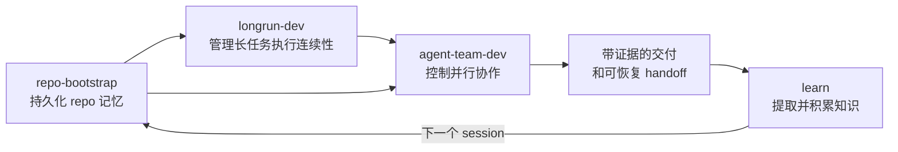

<div align="right">

[](./README.md)
[](./README_CN.md)

</div>

<div align="center">

# Harness Craft

**把 Agentic Coding 从一次性的 prompt 技巧，升级成一套可持续、可验证、可协作、可恢复、可学习的工程系统。**

[](./skills)
[](./rules)
[](#四个核心卖点-skill)
[](#核心思路)
[](#contributing)

</div>

这个仓库背后的核心判断很简单：

> 真正让 agent 工作流失控的，往往不是“模型不够聪明”，而是“系统不够稳定”。

很多团队的痛点其实并不是 agent 不会写代码，而是下面这些更现实的问题：

- agent 上一轮明明已经理解过仓库，这一轮又像失忆一样重新摸索
- 多个 agent 看起来都很忙，但改动互相踩踏，review 结果也不可信
- 文档、计划、验证、交接这些中间状态只存在于对话里，过几天就追不回来
- agent 很容易“感觉自己完成了”，但仓库实际并没有进入可交付状态

这类问题，本质上不是“智力问题”，而是“系统问题”。

## 目录

- [核心思路](#核心思路)
- [快速开始](#快速开始)
- [四个核心卖点 Skill](#四个核心卖点-skill)
- [这套组合是怎么协同工作的](#这套组合是怎么协同工作的)
- [Skills vs Rules](#skills-vs-rules)
- [Rules 参考](#rules-参考)
- [完整 Skill 清单](#完整-skill-清单)
- [适合谁](#适合谁)
- [Contributing](#contributing)

## 核心思路

这个仓库要解决的，不是再多叠一层 prompt。

它要做的是把 agent 工作升级成一套具备以下特性的工程系统：

- **可持久化**：仓库知识不会因为切 session 就丢失
- **可验证**：进展依赖证据，而不是模型自我感觉
- **可协作**：多 agent 并行时边界清晰，不相互踩踏
- **可恢复**：长任务能从稳定状态继续，而不是从模糊记忆重启
- **可学习**：agent 能从交互中积累知识，越用越聪明

这就是整个仓库的设计中心。

### Prompt 技巧 vs 工程系统

| Prompt 优先工作流 | 系统优先工作流 |
| --- | --- |
| 上下文只存在于聊天记录里 | 上下文落在 repo 本地工件里 |
| 完成依赖模型主观判断 | 完成依赖验证证据和检查 |
| 多 agent 协作是临时拼装 | 角色、ownership、review gate 都明确 |
| 长任务容易跨 session 漂移 | 长任务从结构化状态恢复 |
| handoff 很脆弱 | handoff 被直接写进工作流 |

## 快速开始

### 安装 Skills

<details>
<summary><strong>Claude Code</strong></summary>

```bash
# 安装四个核心 skill
mkdir -p ~/.claude/skills
cp -R skills/repo-bootstrap ~/.claude/skills/
cp -R skills/longrun-dev ~/.claude/skills/
cp -R skills/learn ~/.claude/skills/
cp -R skills/agent-team-dev ~/.claude/skills/

# 或整仓安装
cp -R skills/* ~/.claude/skills/
```

目标结构：

```text
~/.claude/skills/
  repo-bootstrap/
  longrun-dev/
  learn/
  agent-team-dev/
  ...
```

</details>

<details>
<summary><strong>Codex (OpenAI)</strong></summary>

```bash
# 安装四个核心 skill
mkdir -p ~/.codex/skills
cp -R skills/repo-bootstrap ~/.codex/skills/
cp -R skills/longrun-dev ~/.codex/skills/
cp -R skills/learn ~/.codex/skills/
cp -R skills/agent-team-dev ~/.codex/skills/

# 或整仓安装
cp -R skills/* ~/.codex/skills/
```

目标结构：

```text
~/.codex/skills/
  repo-bootstrap/
  longrun-dev/
  learn/
  agent-team-dev/
  ...
```

</details>

### 安装 Rules（始终生效的行为准则）

Rules 安装后**无需任何操作**，每次会话自动生效：

```bash
# 用户级（所有项目生效）
mkdir -p ~/.claude/rules
cp -r rules/common ~/.claude/rules/
cp -r rules/python ~/.claude/rules/   # 按需选择语言

# 或项目级（仅当前项目生效）
mkdir -p .claude/rules
cp -r rules/common .claude/rules/
```

安装后 AI agent 会自动：
- 用 `feat:`/`fix:`/`refactor:` 格式写 commit message
- 提交前检查硬编码密钥、SQL 注入、XSS 等安全问题
- 遵循不可变数据模式、函数 <50 行、覆盖率 ≥80%
- Python 文件自动加 type annotations、用 frozen dataclass
- 写完代码后主动触发 code review

## 四个核心卖点 Skill

如果你只想先试四个 skill，优先看这四个：

- `repo-bootstrap`
- `longrun-dev`
- `learn`
- `agent-team-dev`

这四个 skill 分别对应 agent 工作流最容易失控的四个层面：

| Skill | 所在层 | 我想解决的核心问题 | 设计抓手 | 最关键的控制点 | 典型输出 |
| --- | --- | --- | --- | --- | --- |
| `repo-bootstrap` | 上下文层 | 上下文会丢，仓库知识无法持续复用 | 把项目认知拆成长期文档并由结构化状态驱动 | 文档分责、持续更新、显式未知项 | `codex/state.json`、`memory.md`、`prompt.md`、`repowiki.md`、`plan.md`、`checklist.md` |
| `longrun-dev` | 执行连续性层 | 长任务跨 session 后容易漂移、失焦、提前宣布完成 | 把长期开发变成有状态的 harness | 每轮只做一个 feature、先恢复 baseline、必须留 evidence | `.longrun/init.sh`、`feature_list.json`、`progress.md`、`session_state.json` |
| `learn` | 知识积累层 | 交互中的高价值知识会随 session 结束而消失 | 结构化提取 + 强度演化 + 分级作用域 | 质量门控、scope 隔离、半自动提升 | `~/.claude/learned/`、带 `weak→medium→strong` 演化的知识文件 |
| `agent-team-dev` | 协作编排层 | 多 agent 并行容易冲突、失控、噪音大 | 把多 agent 编排成一个小型工程团队 | ownership、角色边界、独立 review、round cap | task contract、role packet、`A1/I1/T1/R1` artifacts |

这四个 skill 组合在一起，才构成这个仓库真正的差异化价值。

### `repo-bootstrap`

**它解决的是“如何保住上下文”。**

这个 skill 最厉害的地方，不是帮 agent 生成了几份文档，而是把仓库认知从隐性的背景知识，改造成显性的工作台。

#### 它到底在解决什么问题

一个 agent 想有效推进任务，光看代码是不够的。它至少还需要知道：

- 当前用户到底想解决什么
- 之前已经做过哪些判断
- 仓库真实的运行、测试、验证方式是什么
- 哪些问题还没有搞清楚
- 当前计划和真实执行是否一致

这些信息如果只散落在聊天窗口里，实际上非常脆弱。  
只要 session 一切换，只要并行线程一多，只要中途换 agent，事实和假设就很容易混在一起。

#### 架构设计

这个 skill 把仓库认知拆成 6 个长期工件：

- `codex/state.json`：机器可读的唯一真相源
- `codex/memory.md`：持续工作记忆
- `codex/prompt.md`：用户意图、约束、解释历史
- `codex/repowiki.md`：仓库事实、目录、命令、环境说明
- `codex/plan.md`：方案设计、假设、风险、验证路径
- `codex/checklist.md`：真实执行账本、文件变更、验证状态

之所以要拆开，是因为这些职责不能混写：

| 文档 | 我让它负责什么 | 为什么不能混在一起 |
| --- | --- | --- |
| `memory.md` | 当前持续工作记忆 | 如果和仓库事实混写，很快会变成流水账 |
| `prompt.md` | 用户意图、约束、解释历史 | 这是任务语义，不该和 repo 结构耦合 |
| `repowiki.md` | 仓库操作事实、目录、命令、环境 | 这是长期事实，不该被会话波动污染 |
| `plan.md` | 方案设计、风险、验证路径 | 这是未来动作，不等于已经执行的结果 |
| `checklist.md` | 执行账本、验证状态、文件变更 | 这是现实进度，不该回写成方案描述 |

#### 这个设计为什么强

1. 它没有假装自动化可以替代理解。  
   脚本可以自动探测语言、框架、命令、配置文件和目录结构，但这些自动化只负责搭骨架，不负责冒充深度理解。

2. 它把更新规则写成了治理要求，而不是建议。  
   `memory.md` 和 `prompt.md` 每轮都该更新；仓库事实变动要反映到 `repowiki.md`；非平凡实现要同步 `plan.md` 与 `checklist.md`。

3. 它把未知项也纳入结构。  
   一个成熟的记忆系统，不只记录已知事实，也记录哪些地方还未知、应该如何发现、哪些内容不该被默认假设。

这会让系统更诚实，也更容易交接和接力。

### `longrun-dev`

**它解决的是“如何让长任务长期不跑偏”。**

绝大多数 agent demo 都很擅长展示“开始”。  
真正的难点是“持续”。

#### 长任务为什么最容易失败

一个任务一旦跨很多 session，就会出现非常典型的失败模式：

- agent 不知道上次做到哪
- baseline 已经坏了，但它还在坏状态上继续叠改动
- feature scope 在多轮中悄悄漂移
- 进度只有叙述，没有结构
- 模型主观上觉得“差不多了”，系统上却没有任何完成证据

这些问题，不是再加一段“请认真工作”就能解决的。  
它们需要状态文件、恢复入口、执行顺序、完成条件，以及对 scope 的节流。

#### 架构设计

这个 skill 会在目标仓库里生成一套 longrun harness：

- `.longrun/init.sh`：依赖准备和 smoke 检查
- `.longrun/feature_list.json`：feature 定义与 pass/fail 状态
- `.longrun/progress.md`：append-only 的 session 进展日志
- `.longrun/session_state.json`：当前恢复状态和会话信息

最重要的一点是：长任务的状态，不再是对话资产，而是 repo 资产。

#### 它的控制模型

| 约束 | 背后的考虑 | 防的是什么问题 |
| --- | --- | --- |
| 每个 session 只推进一个 feature | 限制 scope 膨胀 | 越做越散、顺手多做、目标漂移 |
| 先跑 `init.sh` | 先恢复健康，再谈新增量 | 在坏基线上继续叠 bug |
| `feature_list.json` 主要更新状态字段 | 锁住 feature 定义 | 中途悄悄改写目标 |
| `progress.md` append-only | 保留可追溯轨迹 | 覆盖历史、无法 handoff |
| 完成必须有 evidence | 把“感觉做完”变成“验证通过” | 提前宣告 done |

#### 为什么它体现了真正的“系统意识”

我认为这个 skill 最厉害的不是复杂，而是克制。

“每轮只推进一个 feature” 看起来朴素，但其实是对 agent 非常有效的控制点。agent 最常见的高级错误，往往不是不会做，而是做太多、做太散、做得超出原任务边界。

这个 skill 把长期任务切成一系列可验证、可恢复、可结算的小单元。这样每轮结束时，系统都还能重新判断：

- baseline 是否健康
- 范围是否稳定
- 证据是否充分

这才是长期自治开发真正需要的工程约束。

### `agent-team-dev`

**它解决的是“如何治理多 agent 协作”。**

multi-agent 最大的难点，不是并行能力，而是边界治理。

#### 它到底在解决什么问题

多 agent 工作流经常失控，是因为：

- 多个 agent 改同一片文件，没有明确 ownership
- 大家都在分析，但没有人拥有最终集成权
- review 发生得太早，或者太泛
- 主线程丢掉了“唯一真相源”的角色

如果没有治理，多 agent 只是把单 agent 的不稳定放大。

#### 架构设计

这个 skill 刻意把团队保持在一个小而明确的拓扑里：

| 角色 | 写权限 | 我给它的责任 | 为什么这样切 |
| --- | --- | --- | --- |
| Team Lead | 集成与裁决 | 任务合同、编制、冲突解决、最终验证 | 必须保留唯一真相源 |
| Solution Architect | 只读 | 分析方案、风险热点、文件影响图 | 让设计先于改动 |
| Feature Engineer | 生产代码 | 做最小安全 patch | 把行为实现和其他职责隔离 |
| Test Engineer | 测试代码 | 补测试、守回归 | 让验证成为独立职责 |
| Reviewer / Verifier | 只读 | 看集成后的真实结果 | 避免在半成品阶段给失焦建议 |

#### Mode 选择机制

| 模式 | 使用时机 | 编制 | 我想达到的平衡 |
| --- | --- | --- | --- |
| Mode A | 小改动、低风险、单模块 | 0-1 个 sub-agent | 最低协调成本 |
| Mode B | 实现与测试可并行 | 2 个 sub-agent | 提高吞吐但不失控 |
| Mode C | 高风险、跨模块、需要独立 review | 3-4 个 sub-agent | 以正确性优先的全套保护 |

#### 它和很多“角色扮演式 multi-agent”最大的不同

它并没有沉迷于 multi-agent 的表演感，而是回到了工程组织的基本原理：

- 主线程必须保留一个 Team Lead
- 并行不是默认值，而是风险驱动选择
- 角色不是为了好看，而是为了隔离责任
- review 必须独立，且发生在集成之后
- 最终真相源只能有一个

所以这个 skill 的重点不是”更多 agent 更聪明”，而是”多 agent 必须先被治理”。

### `learn`

**它解决的是”如何让 agent 越用越聪明”。**

每次开发者和 agent 之间的对话，都散落着高价值知识：纠正、模式、事实、偏好。但如果没有学习系统，这些知识会随着 session 结束而消失。下一次对话，agent 又要从零开始，用户又要重新教一遍。

#### 它到底在解决什么问题

- agent 上次被纠正过”不要 mock 数据库”，这次又 mock 了
- 用户已经说过三遍”回答简洁一点”，agent 还是啰嗦
- 项目有特殊的部署流程，每次都要重新解释
- 用户的编码偏好（命名风格、架构模式等）无法被记住

#### 架构设计

这个 skill 的设计灵感来自 ECC 的 continuous-learning 系统，但做了大幅简化：

| 设计决策 | 为什么这样做 | 防的是什么问题 |
| --- | --- | --- |
| 只有两个命令（`/learn` + `/learn-review`） | 最小认知负担 | 用户记不住 6 个命令 |
| 用 Markdown 而不是 YAML | 人可读、可直接编辑 | 知识变成黑盒，用户无法检查 |
| 三档强度（`weak→medium→strong`） | 简单但有效的验证模型 | 浮点数伪精确（0.47 vs 0.52 没有区别） |
| 分 project/global 两级 | 项目经验不污染其他项目 | 跨项目知识污染 |
| 半自动提升（建议+确认） | 用户确认后再全局化 | 错误知识污染所有项目 |
| 质量门控（Save/Merge/Skip） | 保存前过滤噪音 | 知识目录退化成垃圾场 |

#### 四种知识类型（按价值排序）

1. **Corrections（纠正）** — 用户纠正过 agent 的做法，最高价值
2. **Patterns（模式）** — 反复出现的工作流或编码惯例
3. **Facts（事实）** — 项目/环境特定的真实信息
4. **Preferences（偏好）** — 用户的个人风格偏好

#### 为什么它是对 ECC 的改进

ECC v2.1 用 PreToolUse/PostToolUse hooks + Haiku 后台 observer agent + YAML instinct 文件 + 浮点置信度 + 6 个命令。技术上更精密，但对用户来说：

- hooks 依赖平台能力，不通用
- 后台 observer 有额外 LLM 调用成本
- YAML 文件对开发者不友好
- 6 个命令认知负担重

这个 skill 保留了 ECC 最核心的洞察 — **对话是知识金矿** — 但把实现简化到”装上就能用，用了就有感”。没有后台 agent，没有 hooks 依赖，没有 YAML，只有 Markdown 文件和两个命令。

#### 用户体感设计

“越用越聪明”不能只是技术上做到了，用户必须**感受到**：

- 每次 `/learn`，清晰列出学了什么、跳过了什么
- 当 agent 因为已学知识做出不同决策时，主动说明原因
- `/learn-review` 顶部显示累计统计：已积累 23 条全局 / 12 条项目知识

## 这套组合是怎么协同工作的



一句话总结：

- `repo-bootstrap` 让 agent 记得住项目
- `longrun-dev` 让 agent 不跑偏
- `agent-team-dev` 让多个 agent 不失控
- `learn` 让 agent 越用越聪明

## Skills vs Rules

本仓库提供两套互补的系统：

| | Skills | Rules |
|--|--------|-------|
| **类比** | 操作手册 | 宪法 |
| **加载方式** | 按需显式调用（`/skill-name`） | 每次会话自动注入 |
| **占用 context** | 调用时才加载全文 | 始终占用（但每条很短） |
| **适合放什么** | 长篇工作流程（TDD、E2E、深度研究…） | 短小的全局约束（编码风格、安全、Git…） |
| **生效方式** | 用户触发后执行 | 每轮交互自动遵守 |

**一句话**：Rules 是 agent 的**本能反射**，Skills 是 agent 的**后天技能**。

## Rules 参考

> Rules 安装后自动生效，无需手动调用。

### Common Rules（通用，所有语言生效）

| Rule | 自动做什么 |
|------|-----------|
| `coding-style` | 强制不可变数据模式；函数 <50 行、文件 <800 行、嵌套 <4 层 |
| `security` | 每次 commit 前检查：无硬编码密钥、SQL 参数化、XSS/CSRF 防护 |
| `testing` | 强制 TDD（先写测试再写代码）；覆盖率 ≥80% |
| `git-workflow` | commit 格式 `<type>: <description>`；PR 分析完整 commit 历史 |
| `code-review` | 写完代码自动审查；CRITICAL 问题阻止合并 |
| `development-workflow` | 开发流程：先搜索现有方案→规划→TDD→Review→Commit |
| `patterns` | 新功能先搜索成熟骨架项目；推荐 Repository Pattern |
| `performance` | 模型选择建议（Haiku/Sonnet/Opus）；context 管理策略 |
| `agents` | 自动调度子 agent：复杂功能→planner，写完代码→reviewer |
| `hooks` | TodoWrite 最佳实践、权限控制指南 |

### Python Rules（仅 `.py`/`.pyi` 文件生效）

| Rule | 自动做什么 |
|------|-----------|
| `coding-style` | PEP 8；所有函数必须写 type annotations；用 `frozen=True` dataclass |
| `patterns` | Protocol 鸭子类型、dataclass DTO、context manager、generator |
| `security` | `os.environ["KEY"]` 严格取值；bandit 静态扫描 |
| `testing` | pytest + `--cov`；`pytest.mark.unit/integration` 分类 |
| `hooks` | Python 项目 hook 集成指南 |

## 推荐使用顺序

1. 安装 skills 和 rules（见[快速开始](#快速开始)）
2. 先用 `repo-bootstrap` 把仓库知识落盘
3. 任务跨多 session 时，用 `longrun-dev` 管执行连续性
4. 每次有价值的 session 结束后，用 `learn` 积累知识
5. 只有在确实存在并行收益时，再用 `agent-team-dev`
6. 在此基础上，再叠加领域技能

推荐搭配：

- **架构与实现：** `api-design`、`backend-patterns`、`frontend-patterns`、`coding-standards`
- **质量与验证：** `tdd-workflow`、`e2e-testing`、`verification-loop`、`security-review`
- **研究与文档：** `deep-research`、`openai-docs`、`article-writing`
- **交付与流程：** `gh-address-comments`、`gh-fix-ci`、`yeet`、`linear`

## 完整 Skill 清单

除了上面四个核心 skill，这个仓库还包含一系列面向工程、测试、研究、内容、交付的可复用 skills。

<details>
<summary><strong>查看全部 skills</strong></summary>

| Skill | 主要用途 |
| --- | --- |
| `agent-team-dev` | 用明确 ownership 和验证门槛组织小型多 agent 团队 |
| `api-design` | 设计生产级 REST API |
| `article-writing` | 写高质量长文、教程和 Newsletter |
| `backend-patterns` | 设计和优化 Node.js、Express、Next.js 后端 |
| `claude-api` | 构建基于 Claude API 的应用 |
| `learn` | 从交互中提取、积累并应用可复用知识 |
| `longrun-dev` | 用长期 harness 管理跨 session 开发 |
| `coding-standards` | 统一 TS、JS、React、Node 编码规范 |
| `content-engine` | 把一个主题扩成多平台内容系统 |
| `crosspost` | 针对不同平台改写同一主题内容 |
| `deep-research` | 多源研究、引用和综合分析 |
| `develop-web-game` | HTML/JS 游戏的小步迭代与验证 |
| `dmux-workflows` | 用 dmux/tmux 编排多 agent 工作流 |
| `doc` | 创建和编辑 `.docx` 文档 |
| `e2e-testing` | 构建和维护 Playwright E2E 测试 |
| `eval-harness` | 用正式 harness 评估 agent 行为 |
| `exa-search` | 用 Exa 做网页、代码和公司检索 |
| `fal-ai-media` | 生成图像、视频和音频素材 |
| `canvas-design` | 生成视觉设计和海报（.png/.pdf） |
| `figma` | 从 Figma 拉设计上下文和资产 |
| `figma-implement-design` | 把 Figma 节点实现成生产级 UI |
| `frontend-design` | 生产级前端 UI 设计 |
| `frontend-patterns` | 构建可扩展 React/Next.js 前端架构 |
| `frontend-slides` | 制作高表现力的 HTML 幻灯片 |
| `gh-address-comments` | 系统化处理 GitHub PR review comments |
| `gh-fix-ci` | 排查和修复 GitHub Actions 失败 |
| `investor-materials` | 生成融资材料 |
| `investor-outreach` | 写投资人外联与跟进文案 |
| `linear` | 管理 Linear issue 和流程 |
| `market-research` | 市场、竞品和尽调研究 |
| `openai-docs` | 使用官方 OpenAI 文档并带引用 |
| `paper-deep-review` | 深入阅读和解释论文 |
| `pdf` | 解析、生成和检查 PDF |
| `playwright` | 从终端自动化真实浏览器 |
| `repo-bootstrap` | 持久化 repo 记忆并持续生成上下文文档 |
| `screenshot` | 截取桌面或应用截图 |
| `webapp-testing` | 基于 Playwright 的本地 Web 应用测试 |
| `security-review` | 审查鉴权、密钥、输入处理和敏感流 |
| `mcp-builder` | 构建 MCP Server（Python FastMCP / Node SDK） |
| `skill-creator` | 创建或优化 skills |
| `skill-installer` | 安装 skills 到本地环境 |
| `strategic-compact` | 在关键里程碑压缩上下文 |
| `tdd-workflow` | 用测试先行推动实现 |
| `verification-loop` | 交付前做结构化验证 |
| `video-editing` | AI 辅助视频编辑 |
| `x-api` | 集成 X/Twitter API |
| `yeet` | 一次性完成 stage/commit/push/开 PR |

</details>

## 适合谁

- 想把 agent 用成“长期协作者”而不是“聊天助手”的开发者
- 想做多步实现、测试、交付自动化的团队
- 在意 handoff 质量、验证纪律、可恢复性的工程师
- 觉得 agent demo 很惊艳，但生产落地还不够稳的人

## Contributing

欢迎提交 PR，但标准是“真正有用”。

一个好的 skill，至少应该：

- 解决真实且重复出现的问题
- 有明确触发条件
- 给出具体 workflow，而不是泛泛建议
- 在必要时提供脚本或参考资料
- 真正提升可重复性、正确性或可恢复性
